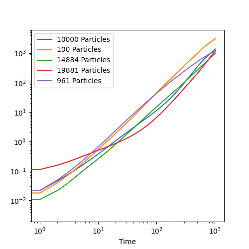

# Particle Simulation

https://user-images.githubusercontent.com/26287286/222632792-91d1d23a-1308-4cad-b08c-5581b38f6ed4.mp4

## Overview

This project is for the Scientific Computing class at Olin College of Engineering. The goal for this project was to implement the simulation such that it could be GPU accelerated - as such, it is written entirely in JAX and compiled into XLA. Rendering is done with ModernGL.

## Setup

1. Clone the repository.
2. (Recommended) Setup and activate a virtual environment:

```
python -m vevn venv
source venv/bin/activate
```

3. Install dependencies:

```
pip install -r requirements.txt
```

If a virtual env was created, it will have to be re-activated before running the code if the original terminal session is terminated.

By default, JAX's CPU version will be installed. To run the simulation of GPU, please follow JAX's [GPU installation guide](https://github.com/google/jax#pip-installation-gpu-cuda). Alternatively, see [this notebook](https://colab.research.google.com/drive/1YVu-qczoVuJSKLdTkU4fFM66L1Np6DW4?usp=sharing) to run this project in colab. (Make sure to select a GPU colab instance after copying the notebook.)

## Run

The simulation can be run with default parameters with:

```
python particles/run.py
```

To see which parameters can be tuned from the command line, see:

```
python particles/run.py --help
```

## Architecture

### Simulation

Broadly, the simulation flow is as such:
1. Build uniform grid
2. Get particle neighbors
3. Get collisions
4. Get particle collision responses
5. Get wall collision responses
6. Move particles
7. Resolve particle overlaps
8. Resolve out-of-bounds particles

### Overall

Outside of the simulation, there are several other constructs. The `run` file handles parsing arguments and starting the simulation, the `render` file defines the `Renderer` class that runs the simulation and does real-time rendering, and the `simulation` file holds the simulation logic.

## Results

The simulation is able to run efficiently, rendering up to 1 million paticles at ~0.5 frames per second. The dynamics also perform semi-realistically - collisions behave as expected, and clustering behavior as well as the beginning of crystallization can be observed. The dynamics seem to break down when particles are begin pressed against the boundary of the simulation, and large clumps of particles start to congregate.



The log-log graph of particle shift from their original positions has a slope significantly higher than 1. This indicates that the dynamics aren't quite right - we would expect the slope of the graph to be ~1 for non-glass liquids. 
