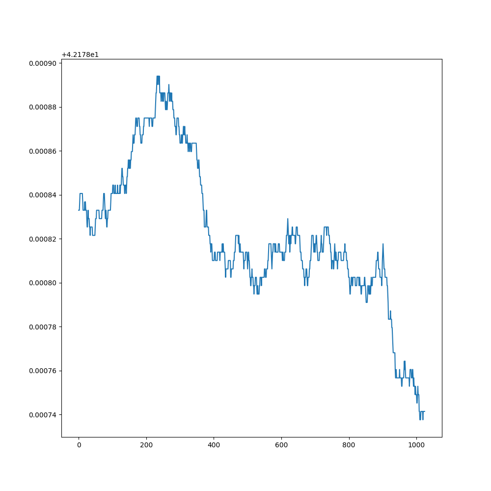

# Particle Simulation

https://user-images.githubusercontent.com/26287286/222931373-cffc3788-5bfd-4bbc-b1fc-e153e08db200.mp4

*100,000 particles in a 1024x1024 grid.*

## Overview

This project is for the Scientific Computing class at Olin College of Engineering. The goal for this project was to implement the simulation such that it could be GPU accelerated - as such, it is written entirely in JAX and compiled into XLA. Rendering is done with ModernGL.

## Setup

1. Clone the repository.
2. (Recommended) Setup and activate a virtual environment:

```
python -m vevn venv
source venv/bin/activate
```

3. Install dependencies:

```
pip install -r requirements.txt
```

If a virtual env was created, it will have to be re-activated before running the code if the original terminal session is terminated.

By default, JAX's CPU version will be installed. To run the simulation of GPU, please follow JAX's [GPU installation guide](https://github.com/google/jax#pip-installation-gpu-cuda). Alternatively, see [this notebook](https://colab.research.google.com/drive/1YVu-qczoVuJSKLdTkU4fFM66L1Np6DW4?usp=sharing) to run this project in colab. (Make sure to select a GPU colab instance after copying the notebook.)

## Run

The simulation can be run with default parameters with:

```
python particles/run.py
```

To see which parameters can be tuned from the command line, see:

```
python particles/run.py --help
```

## Results

The simulation is able to run efficiently, rendering up to 1 million paticles at ~0.5 frames per second. The dynamics also perform semi-realistically - collisions behave as expected, and clustering behavior as well as the beginning of crystallization can be observed. The dynamics seem to break down when particles are begin pressed against the boundary of the simulation, and large clumps of particles start to congregate.


The log-log graph of particle shift from their original positions has a slope significantly higher than 1. This indicates that the dynamics aren't quite right - we would expect the slope of the graph to be ~1 for non-glass liquids. 



The sum of magnitudes of velocities, on the other hand, is slightly more promising. While the overall value does shift, some degree of inaccuracy is expected from floating point error. More encouraginly, there is no clear pattern to this shifts, and the deviation is not too great.

## Architecture

### Simulation

Broadly, the simulation flow is as such:
1. Build uniform grid
2. Get particle neighbors
3. Get collisions
4. Get particle collision responses
5. Get wall collision responses
6. Move particles
7. Resolve particle overlaps
8. Resolve out-of-bounds particles

### Overall

Outside of the simulation, there are several other constructs. The `run` file handles parsing arguments and starting the simulation, the `render` file defines the `Renderer` class that runs the simulation and does real-time rendering, and the `simulation` file holds the simulation logic.

## Algorithms

### Uniform Grid

A uniform grid is a datastructure used to make the compuation of collision more efficient. A grid is overlayed over the scene, and each particle is placed into the grid cell that its center falls into. Then, instead of computing collision against all particles in the scene, we can instead compute collisions against particles in neighboring cells.

Building the uniform grid in a parallel manner with JAX was non-trivial. The primary difficulty is in JAX's inability to handle ragged tensors, even as an intermediate product of an operation. The uniform grid almost always has a variable number of particles in each cell, so additional handling is required to implement it in JAX. Here, we use a padding approach. First, we compute how many particles are in each cell. Then, we generate padding particles to fill each cell to a pre-defined max particles per cell limit. Doing so allows us to treat every cell as if they had the same numbers of particles, which in turn makes handling the cells in JAX trivial.

### Collision Response

This simulation uses a impulse based collision response algorithm. For every collision a particle encouters, an impulse is generated. If a particle collides with multiple other particles in a single timestep, the impulse it imparts is split evenly across those particles. The post-collision velocity of a particle is determined by the sum of the impulses applied to the particle.

Additionaly, we attempt to correct for floating point error. Without handling, floating point error accumlates over the sum over impulses, and when computing many collisions begins to affect the simulation such that velocity depletes over time. To correct for this, we make the assumption that the total magnitude of velocities should remain the same, assuming that all collisions are elastic. We compute the sum of magnitudes of the velocities before and after our collision response, then compute the ratio between the two. The post-collision velocities are then multiplied by the ratio. This stabalizes the simulation and allows for the emergence of more complex phenomena.

### Particle Overlaps

We take a naive approach to resolving particle overlaps. For every collsion, we compute the movement along the collision normal to un-overlap the particles. Then, the particle is moved by the sum of these movement vectors. As this will not perfectly solve overlaps in a single step, we repeat the process 8 times, although the number of iteration can be varied based on whether we prioritize efficiency or correctness.
