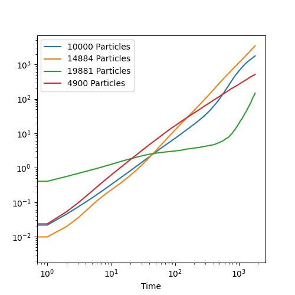

# Particle Simulation

<div align="center">
  <video src="https://user-images.githubusercontent.com/26287286/222981769-34b26f5b-3489-4bc6-a59e-9de8b78c8d3c.mp4" width=400/>
</div>

<div align="center"><i>1,000,000 particles in a 2048x2048 grid></i></div>

## Overview

This project is for the Scientific Computing class at Olin College of Engineering. The goal for this project was to implement the simulation such that it could be GPU accelerated - as such, it is written entirely in JAX and compiled into XLA. Rendering is done in ModernGL.

## Setup

1. Clone the repository.
2. (Recommended) Setup and activate a virtual environment:

```
python -m vevn venv
source venv/bin/activate
```

3. Install dependencies:

```
pip install -r requirements.txt
```

If a virtual env was created, it will have to be re-activated before running the code if the original terminal session is terminated.

By default, JAX's CPU version will be installed. To run the simulation of GPU, please follow JAX's [GPU installation guide](https://github.com/google/jax#pip-installation-gpu-cuda). Alternatively, see [this notebook](https://colab.research.google.com/drive/1YVu-qczoVuJSKLdTkU4fFM66L1Np6DW4?usp=sharing) to run this project in colab. (Make sure to select a GPU colab instance after copying the notebook.)

## Run

The simulation can be run with default parameters with:

```
python particles/run.py
```

To see which parameters can be tuned from the command line, see:

```
python particles/run.py --help
```

## Architecture

### Simulation

Broadly, the simulation flow is as such:
1. Build uniform grid
2. Get particle neighbors
3. Get collisions
5. Get wall collision responses
4. Get particle collision responses
6. Move particles
7. Resolve particle overlaps
8. Resolve out-of-bounds particles

### Overall

Outside of the simulation, there are several other constructs. The `run` file handles parsing arguments and starting the simulation, the `render` file defines the `Renderer` class that runs the simulation and does real-time rendering, and the `simulation` file holds the simulation logic. The `graph` file lives outside the normal simulation runtime, and combines the artifacts of several simulations into a single plot.

## Algorithms

### Uniform Grid

A uniform grid is a datastructure used to make the compuation of collision more efficient. A grid is overlayed over the scene, and each particle is placed into the grid cell that its center falls into. Then, instead of computing collision against all particles in the scene, we can instead compute collisions against particles in neighboring cells.

Building the uniform grid in a parallel manner with JAX was non-trivial. The primary difficulty is in JAX's inability to handle ragged tensors, even as an intermediate product of an operation. The uniform grid almost always has a variable number of particles in each cell, so additional handling is required to implement it in JAX. Here, we use a padding approach. First, we compute how many particles are in each cell. Then, we generate padding particles to fill each cell to a pre-defined max particles per cell limit. Doing so allows us to treat every cell as if they had the same numbers of particles, which in turn makes handling the cells and the creation of the uniform grid in JAX trivial.

### Collision Response

This simulation uses a impulse based collision response algorithm. For every collision a particle encouters, an impulse is generated. If a particle collides with multiple other particles in a single timestep, the impulse it imparts is split evenly across those particles. The post-collision velocity of a particle is determined by the sum of the impulses applied to the particle.

Additionaly, we attempt to correct for floating point error. Without handling, floating point error accumlates over the sum over impulses, and when computing many collisions begins to affect the simulation such that velocity depletes over time. To correct for this, we make the assumption that the total magnitude of velocities should remain the same, assuming that all collisions are elastic. We compute the sum of magnitudes of the velocities before and after our collision response, then compute the ratio between the two. The post-collision velocities are then multiplied by the ratio. This stabalizes the simulation and allows for the emergence of more complex phenomena.

### Particle Overlaps

We take a naive approach to resolving particle overlaps. For every collsion, we compute the movement along the collision normal to un-overlap the particles. Then, the particle is moved by the sum of these movement vectors. As this will not perfectly solve overlaps in a single step, we repeat the process an arbitrary number of times. The number of steps this must be run varies based on the maximium concentration of particles - when many are packed together, more steps are neccesary to preserve reasonable simulation dynamics.

## Results

The simulation is able to run efficiently, rendering up to 100,000 particles at ~5 frames per second. The dynamics also perform semi-realistically - collisions behave as expected, and clustering behavior as well as the beginning of crystallization can be observed. 

(Note: Red indicates particles moving at faster speeds, while blue indicates slower speeds.)

### Base Results

<div align="center">
  <video src="https://user-images.githubusercontent.com/26287286/222972214-aedc30b1-b09a-474a-b3c4-c241ce43be4f.mp4"/>
</div>

<div align="center"><i>5,000 particles in a 256x256 grid</i></div>

When there are a smaller number of particles, they are relatively un-compressed and the particles move about freely.

<div align="center">
  <video src="https://user-images.githubusercontent.com/26287286/222972430-c86c917f-f151-43f3-9a70-90253a850faa.mp4"/>
</div>

<div align="center"><i>10,000 particles in a 256x256 grid</i></div>

As the number of particles increase, we start to see some crystallization along the edges of the simulation.

<div align="center">
  <video src="https://user-images.githubusercontent.com/26287286/222972428-e71b0a46-5f21-4c92-8fca-72508a9c738a.mp4"/>
</div>

<div align="center"><i>15,000 particles in a 256x256 grid</i></div>

At higher densities, crystallization occurs even faster.

<div align="center">
  <video src="https://user-images.githubusercontent.com/26287286/222972421-9cbf7a43-3009-4afa-834e-aa1c274256c4.mp4"/>
</div>

<div align="center"><i>20,000 particles in a 256x256 grid</i></div>

And at maximium saturation, the entire simulation is almost static.

From observing the simulation, we can confirm that the simple dyanmics of the simulation work as expected - particle respect the boundaries of the simulation, and collisions between particles under low concentration look realistic. However, the behavior where red particles, particles that have some velocity, collide and stick to large clusters of blue, unmoving particles is concerning. One would expect that the moving particle distributes (and loses) its velocity on collision and sticks, or retains its velocity and bounces. Sticking while retaining the velocity is concerning. This perhaps points to an unrealistic portion of the simulation, where the velocity resulting from a collision isn't quite realistically modeled.

<div align="center">
  
</div> 

Looking at the average change in X position over time, we can partially see our observations. In particular, it is clear that the 20,000 particle simulation that was operating at a high density had less movement overtime. However, contrary to our observations, the other three simulations all seem to present a similar amount of movement over time. Considering that in all 3 some particles continue to move throughout the simulation, perhaps this makes sense.

### Large Scale Results

Similar patterns hold up for larger numbers of particles. For this set of runs, we fixed the number of particles at 100,000, and ran at various sizes to test different densities.

<div align="center">
  <video src="https://user-images.githubusercontent.com/26287286/222931373-cffc3788-5bfd-4bbc-b1fc-e153e08db200.mp4"/>
</div>

<div align="center"><i>100,000 particles in a 1024x1024 grid</i></div>


<div align="center">
  <video src="https://user-images.githubusercontent.com/26287286/222939236-d827a0cc-1cdd-4b45-bf68-bf74a9c3c219.mp4" width=400/>
</div>

<div align="center"><i>100,000 particles in a 832x832 grid</i></div>

<div align="center">
  <video src="https://user-images.githubusercontent.com/26287286/222981744-037424fc-5bba-4782-9d68-911504f80786.mp4" width=400/>
</div>

<div align="center"><i>100,000 particles in a 694x694 grid</i></div>
